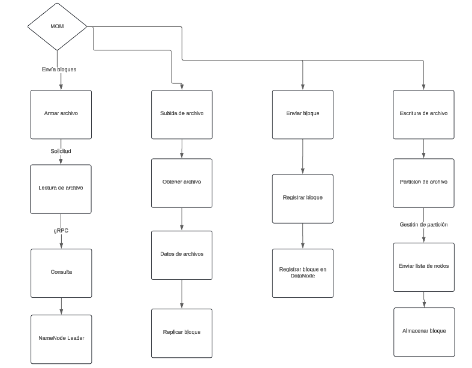

# **ST0263 Tópicos Especiales en Telemática**

# **Estudiantes**: Samuel Garcia Correa, Sgarciac6@eafit.edu.co - Juan Andres Vera Alvarez, javeraa@eafit.edu.co

# **Profesor**: ALVARO ENRIQUE OSPINA SANJUAN , aeospinas@eafit.brightspace.com
*******


### **Proyecto 1**
El proyecto consiste en diseñar un sistema de archivos distribuido, que permita compartir y descargar de manera concurrente cualquier tipo de archivo que se encuentre almacenado en un conjunto de nodos gestionados por un servidor principal. El servidor principal lo conoceremos con NameNode, y el conjunto de nodos sobre el cual se almacenaran los distintos archivos subidos en el sistema se conoceran como DataNodes. Ademas, la red de DataNodes se comportara a su vez como una red P2P.

*******

### ***Requisitos completados***
* El sistema debe permitir al usuario subir un archivo.
* El almacenamiento de archivos en el sistema se debe realizar por bloques.
* El sistema debe tener un registro de los distintos archivos subidos en el sistema.
* El cliente debe utilizar sus propios recursos para particionar el archivo que desea subir.
* Los DataNodes deben garantizar una replicacion de los bloques que reciben.
* El sistema debe permitir al usuario obtener una lista de los archivos disponibles en el sistema.
* El sistema debe implementar MOM como middleware para la transferencia de archivos.


### ***Requisitos no completados***
*

*******

### ***Arquitectura***



*******

### **Descripción del ambiente de desarrollo y técnico***
Este proyecto fue desarrollado en Python y se utilizaron las siguientes librerias para el desarrollo del mismo, todas las que son necesarias instalar vienen para ser instaladas dentro del archivo texto requirements.txt:

* **threading , re , socket , random , json , configparser , os, sys**
* **grpc version >= 1.62.0**
* **grpcio-tools version >= 1.62.0**
* **pika version >= 1.3.2**

Se tienen tres carpetas principales, Server (NameNode), DataNode, Cliente, las explicaremos en orden para entender un poco el funcionamiento de lo desarrollado.

1. La carpeta Server, en este caso, el NameNode, es el encargado de gestionar las conexiones de los DataNode y de proporcionar la diferente informacion que el usuario solicite a la aplicacion. Se genera un archivo data.json en el cual se va guardando la informacion contenida en el servidor, como por ejemplo, que archivos estan en el sistema, el tamaño de cada archivo, en cuantos bloques esta dividido dicho archivo y los nodos que tienen cada uno de los bloques en los que esta dividido. El server levanta un servicio gRPC a traves del cual respondera las distintas solicitudes realizadas por el usuario, y inicia un servidor que espera las conexiones de los distintos DataNodes.

2. La carpeta DataNode, los DataNodes se conectan al servidor solicitando un peer al cual conectarse, si es el unico DataNode disponible, es registrado por el servidor para que cuando otro DataNode ingrese, se conecte al ya existente, esta diseñado de tal manera para que se forme una especie de cadena entre los DataNodes, donde el ultimo DataNode que llegue, se conecta al primero y al penultimo, se explica un poco mejor en la imagen a continuacion.


Los DataNodes levantan a su vez tambien dos servicios, MOM y gRPC, el servicio de MOM sera utilizado principalmente para todo el tema de transferencia de archivos, por este servicio recibe los bloques enviados por el usuario y envia los bloques en caso tal un usuario los solicite, el servicio de gRPC es utilizado principlamente para que el usuario pueda comunicarse con el DataNode para solicitarle el envio de los diferentes bloques. Adicionalmente, levantan un servidor, en este caso por sockets, el cual sera utilizado exclusivamente para informarle al servidor que me uni a la red o para conectarse a otro DataNode, esto se realiza para agregar en cada DataNode una lista de peers conocidos.

3. La carpeta Cliente, el cliente se comunica para realizar cualquiera de las funcionalidades del sistema, subir un archivo, descargar un archivo o listar los archivos disponibles en el sistema. El usuario tambien inicializa los servicios MOM y gRPC, de igual manera para llamar tanto funciones en el sistema como recibir y enviar archivos.


Se definieron los siguientes puertos para el uso de cada uno de los middlewares:
* **8000** utilizado para sockets.
* **8001** utilizado para gRPC.
* **5672** utilizado para MOM.

*******

#### ***Descripción de como configurar y como ejecutar el proyecto***

Para ejecutar el código es necesario crear mínimo tres instancias en AWS, esto para cada una de las interfaces, Cliente, DataNode, Server. Para un buen funcionamiento seguir por favor las siguientes instrucciones:

Crear tres (la cantidad deseada) instancias de EC2 con OS Ubuntu 20.04, recomendable usar el mismo grupo de seguridad para las instancias creadas para no configurar cada una manualmente. Una vez la instancia este creada, ir a los grupos de seguridad y editar las reglas de entrada, vamos a habilitar los siguientes puertos, cada uno de tipo TCP y permitiendo origen desde 0.0.0.0/0:
  * 8000
  * 8001
  * 5672

En mi caso, la conexión a las instancias lo hago con la aplicación PuTTY, pueden usar cualquiera que deseen que les permita interactuar con la instancia. Vamos a ejecutar los siguientes comandos:

```ssh
sudo apt-get update
sudo apt-get upgrade
sudo apt-get install python3
sudo apt-get install python3-pip
```

Una vez llegados a este punto, es necesario definir los roles de las instancias, me refiero a que es necesario establecer cual vamos a usar como Cliente, cual como Servidor y cual como DataNode. Una vez hecho esto, solo es pararnos en la carpeta correspondiente.

```ssh
cd Server
cd Cliente
cd DataNode
```

Es importante mencionar que el cliente es quien subira los archivos a el sistema, para subirlos, es necesario agregar los archivos a la carpeta Cliente/files/ por defecto, dicha carpeta vendra con un archivo llamado file.mp3, corresponde a una cancion con un tamaño considerable para tener una buena cantidad de bloques de dicho archivo.

Una vez estemos parados en las distintas carpetas en cada instancia, procederemos a ejecutar el programa, para las tres instancias basta con ejecutar el siguiente comando.

```ssh
sudo python3 main.py
```

La unica que no deberia mostrar una interfaz sera la instancia del servidor, para el resto de instancias nos solicitara la IP del servidor al cual nos vamos a conectar, en ese caso, colocaremos la proporcionada en AWS correspondiente a la instancia del servidor.

En el caso del cliente, se nos proporcionara una interfaz como la siguiente.

```ssh
Select a number to navigate through the menu.
1. List files.
2. Upload file.
3. Download file.

0. Exit.
```

Una vez llegados a este punto podemos interactuar con el sistema, teniendo en cuenta que no podremos descargar archivos que no esten en el sistema y que no podremos subir archivos que no esten dentro de la ruta de files, especificada anteriormente.

En las instancias tanto del servidor como de los DataNodes, podremos ver diferente informacion que va ocurriendo a medida que el usuario interactua con el sistema.